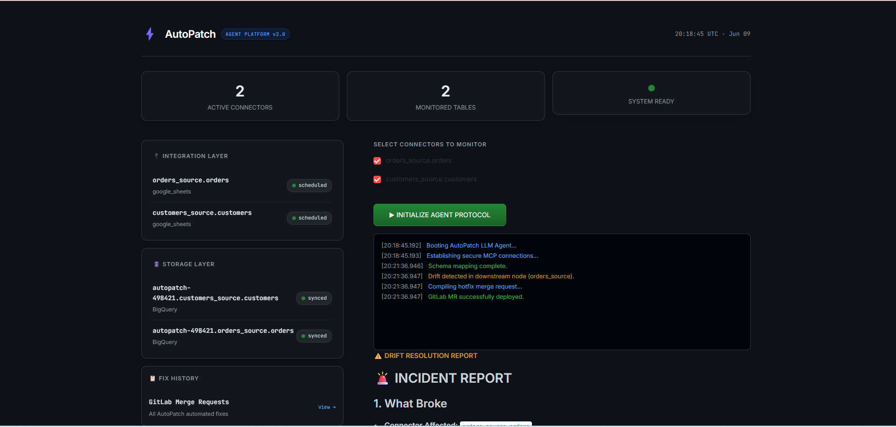
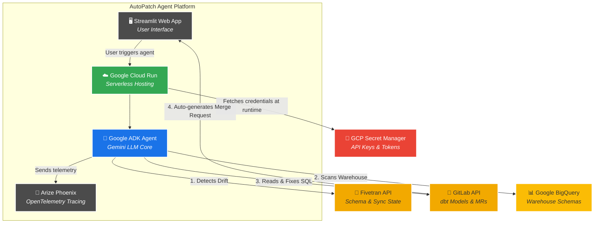

# ⚡ AutoPatch

> *It's 2am. Your board meeting is in 6 hours. Your revenue data is wrong. You're asleep. AutoPatch isn't.*

**AutoPatch** is an autonomous AI agent that sits between your data ingestion tools and your warehouse. When an upstream schema changes, it dynamically catches the drift, figures out the downstream impact, and autonomously opens a GitLab Merge Request to fix your broken dbt models before the morning standup.

Built for the [Google Cloud Rapid Agent Hackathon 2026](https://rapid-agent.devpost.com/).



---

## 🏗️ Architecture



## 🛠️ The Tech Stack

- **Agent Framework:** [Google ADK (Agent Development Kit)](https://github.com/google/agent-development-kit)
- **Core LLM:** `gemini-3.5-flash` (via Google AI Developer API)
- **Data Integrations:** Fivetran (Source), Google BigQuery (Warehouse)
- **Version Control:** GitLab API (Auto-generating MRs)
- **Observability:** Arize Phoenix (OpenTelemetry LLM tracing)
- **Deployment:** Google Cloud Run + GCP Secret Manager
- **Frontend:** Streamlit (Custom Dark Mode UI)
- **Package Management:** `uv`

---

## 🚀 Running Locally

AutoPatch uses `uv` for blazing-fast package management. If you don't have it installed, run `pip install uv` first.

```bash
git clone https://github.com/KongaraLikhith/autopatch.git
cd autopatch
uv venv
uv sync
```

### Environment Setup

You will need a few API keys to get the agent talking to your infrastructure. Create a `.env` file in the root directory:

```env
GEMINI_API_KEY=your_gemini_key
PHOENIX_API_KEY=your_arize_phoenix_key
PHOENIX_COLLECTOR_ENDPOINT=https://app.phoenix.arize.com/s/likhith0715/v1/traces
FIVETRAN_API_KEY=your_fivetran_key
FIVETRAN_API_SECRET=your_fivetran_secret
GITLAB_TOKEN=your_gitlab_token
```

### Start the Agent UI

```bash
uv run streamlit run app.py \
  --server.port 8080 \
  --server.enableCORS false \
  --server.enableXsrfProtection false
```
The UI will spin up at `http://localhost:8080`. 

---

## ☁️ Deploying to Google Cloud Run

To deploy AutoPatch to the public internet securely using GCP Secret Manager:

1. Create your secrets in GCP Secret Manager (`gemini-api-key`, `fivetran-api-key`, `fivetran-api-secret`, `gitlab-token`, `arize-phoenix-api-key`).
2. Run the deployment command:

```bash
gcloud run deploy autopatch \
  --source . \
  --region us-central1 \
  --allow-unauthenticated \
  --set-secrets="GEMINI_API_KEY=gemini-api-key:latest,FIVETRAN_API_KEY=fivetran-api-key:latest,FIVETRAN_API_SECRET=fivetran-api-secret:latest,GITLAB_TOKEN=gitlab-token:latest,PHOENIX_API_KEY=arize-phoenix-api-key:latest"
```

---

## 🎮 How to use it
1. Check the dashboard to make sure the integration layers are connected (the status LEDs should be green).
2. Hit **Initialize Agent Protocol** to kick off a pipeline scan.
3. The terminal in the UI will stream the agent's internal thought process and tool calls in real-time. 
4. **Want to see the LLM's brain?** Click the "Live Traces" button to jump into Arize Phoenix and inspect the exact tool payloads, context windows, and token usage.
5. If the agent finds a break, review the incident report and follow the link to the autonomously generated GitLab MR.

## 📄 License
This project is licensed under the [MIT License](LICENSE).

---

> [!WARNING]
> **API Rate Limits Note**
> The live AutoPatch demo is currently deployed using a Free-Tier Google AI Developer API Key. Because the agent processes multiple tools in a rapid thought loop, you may occasionally hit the **5 requests-per-minute rate limit** (`429 Too Many Requests`) while testing the demo. This is a limitation of the free API tier, not the code. If you experience this, simply wait 60 seconds and click the button again!